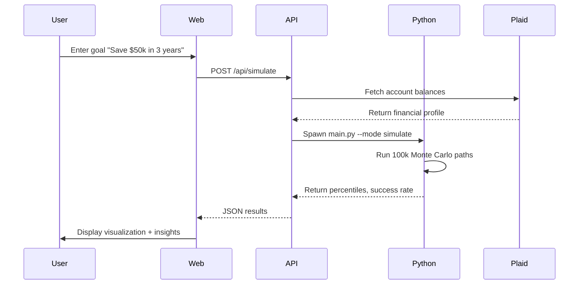

Drift is a Monte Carlo financial forecasting platform built as a modern monorepo with a Next.js frontend, Express API backend, and high-performance Python simulation engine.

## Architecture Diagram

```
┌─────────────────────────────────────────────────────────────┐
│                      Turborepo Monorepo                     │
├─────────────────┬─────────────────┬─────────────────────────┤
│   Next.js Web   │   Express API   │  Python Simulation      │
│   (Port 3000)   │   (Port 3001)   │  Engine                 │
├─────────────────┼─────────────────┼─────────────────────────┤
│ • React 18      │ • Routes        │ • NumPy Vectorization   │
│ • Tailwind CSS  │ • Services      │ • Multiprocessing       │
│ • Three.js      │ • Type System   │ • Pydantic Models       │
│ • Recharts      │ • Integrations  │ • Goal Parser (AI)      │
│ • TanStack      │                 │ • Sensitivity Analysis  │
│   Query         │                 │                         │
└─────────────────┴─────────────────┴─────────────────────────┘
         ↓                ↓                      ↓
┌─────────────────┬─────────────────┬─────────────────────────┐
│  External APIs  │  Financial APIs │  AI Services            │
├─────────────────┼─────────────────┼─────────────────────────┤
│ • Plaid         │ • Nessie Bank   │ • Gemini (Goal Parse)   │
│ • HPC Clusters  │                 │ • ElevenLabs (Voice)    │
└─────────────────┴─────────────────┴─────────────────────────┘
```

## Monorepo Structure

Drift uses **Turborepo** for efficient monorepo management:

```bash
source/
├── apps/
│   ├── web/          # Next.js frontend application
│   └── api/          # Express backend API
├── simulation/       # Python Monte Carlo engine
├── scripts/          # Utility scripts (seeding, etc.)
├── turbo.json        # Turborepo configuration
└── package.json      # Root package manager
```

### Workspace Configuration

The monorepo is managed via npm workspaces:

```json
{
  "name": "drift",
  "packageManager": "npm@10.8.2",
  "workspaces": ["apps/*"],
  "scripts": {
    "dev": "turbo run dev",
    "build": "turbo run build",
    "dev:web": "npm run dev --workspace=apps/web",
    "dev:api": "npm run dev --workspace=apps/api"
  }
}
```

## Technology Stack

### Frontend (Next.js)

- **Framework**: Next.js 14 with App Router
- **UI Library**: React 18 with TypeScript
- **Styling**: Tailwind CSS + shadcn/ui components
- **3D Graphics**: Three.js + React Three Fiber
- **Charts**: Recharts for data visualization
- **State Management**: TanStack Query for server state
- **API Client**: Axios

### Backend (Express)

- **Runtime**: Node.js with TypeScript
- **Framework**: Express.js
- **Validation**: Zod schemas
- **Development**: tsx watch for hot reload
- **Testing**: Jest + ts-jest

### Simulation Engine (Python)

- **Language**: Python 3.10+
- **Numeric Computing**: NumPy for vectorized operations
- **Validation**: Pydantic v2 for type safety
- **Parallelization**: multiprocessing with worker pools
- **AI Integration**: OpenAI for goal parsing

## Key Components

### 1. Frontend Layer

The Next.js frontend provides:
- Interactive UI for financial goal input
- Real-time Monte Carlo visualization with Three.js particles
- Recharts-based result dashboards
- Plaid Link integration for bank connectivity
- Voice input via ElevenLabs

### 2. API Layer

The Express API orchestrates:
- **Simulation Routes**: Trigger Python Monte Carlo engine
- **Financial Data**: Aggregate Plaid/Nessie account data
- **AI Services**: Goal parsing with Gemini, voice with ElevenLabs
- **HPC Integration**: Cluster job submission for large simulations
- **What-If Analysis**: Sensitivity testing

### 3. Simulation Engine

The Python engine performs:
- **Monte Carlo Simulations**: 100k+ scenarios with NumPy vectorization
- **Multiprocessing**: Parallel execution across CPU cores
- **Account-Aware Modeling**: Per-card credit interest, loan amortization
- **Dynamic Parameters**: Derived from real Plaid account data
- **Sensitivity Analysis**: Test impact of income/spending/timeline changes

## Data Flow

### Simulation Request Flow



<Steps>
  <Step title="User Input">
    User enters financial goal via form or voice input
  </Step>
  <Step title="Data Aggregation">
    API fetches account data from Plaid/Nessie
  </Step>
  <Step title="Parameter Derivation">
    API calculates income, spending, volatility from transactions
  </Step>
  <Step title="Simulation Execution">
    Python engine runs 100k Monte Carlo scenarios in parallel
  </Step>
  <Step title="Results Presentation">
    Frontend displays success probability, percentiles, and insights
  </Step>
</Steps>

## Development Workflow

### Local Development

Start all services concurrently:

```bash
npm run dev
```

This runs:
- `apps/web` on http://localhost:3000
- `apps/api` on http://localhost:3001

### Turborepo Task Pipeline

Defined in `turbo.json`:

```json
{
  "tasks": {
    "build": {
      "dependsOn": ["^build"],
      "outputs": [".next/**", "dist/**"]
    },
    "dev": {
      "cache": false,
      "persistent": true
    }
  }
}
```

<Note>
  Turborepo caches build outputs for faster incremental builds across the monorepo.
</Note>

## Deployment Architecture

### Production Setup

- **Frontend**: Deployed to Vercel with edge caching
- **API**: Node.js server on cloud provider (AWS/GCP/Render)
- **Python Engine**: Co-located with API or separate compute cluster
- **Database**: Not currently used (stateless simulations)

### Environment Variables

Required configuration:

```bash
# API Keys
PLAID_CLIENT_ID=your_plaid_client_id
PLAID_SECRET=your_plaid_secret
GEMINI_API_KEY=your_gemini_key
ELEVENLABS_API_KEY=your_elevenlabs_key

# Nessie Bank API
NESSIE_API_KEY=your_nessie_key

# Server Configuration
PORT=3001
```

## Security Considerations

<Warning>
  Never commit `.env` files or API keys to version control. Use environment-specific `.env.local` files.
</Warning>

### API Security

- **CORS**: Configured to allow frontend origin only
- **Rate Limiting**: Should be implemented for production
- **Input Validation**: Zod schemas validate all API inputs
- **Plaid Access Tokens**: Stored in memory, not persisted

### Data Privacy

- **No Database**: Simulations are stateless, no user data stored
- **Plaid Integration**: Uses OAuth for secure bank linking
- **Financial Data**: Processed in-memory, not logged

## Performance Characteristics

### Simulation Performance

- **100k simulations**: ~2-5 seconds (4 workers)
- **Vectorization**: NumPy operations ~100x faster than Python loops
- **Parallelization**: Linear scaling up to CPU core count
- **Memory**: ~200MB for 100k simulations

### Frontend Performance

- **Initial Load**: Next.js SSR for fast First Contentful Paint
- **Particle Animation**: 60 FPS canvas rendering (150 particles)
- **Code Splitting**: Automatic route-based chunking

## Next Steps

Explore the detailed architecture of each layer:

<CardGroup cols={3}>
  <Card title="Frontend Architecture" icon="display" href="/architecture/frontend">
    Next.js app structure, components, and Three.js visualization
  </Card>
  <Card title="Backend Architecture" icon="server" href="/architecture/backend">
    Express API routes, services, and integration layer
  </Card>
  <Card title="Simulation Engine" icon="calculator" href="/architecture/simulation-engine">
    Python Monte Carlo engine internals and algorithms
  </Card>
</CardGroup>
